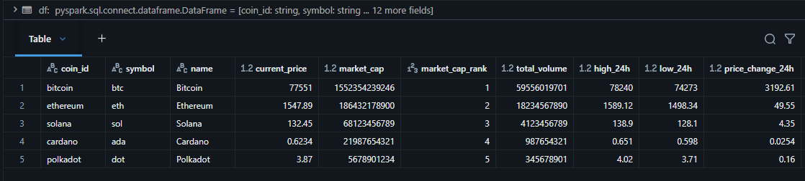
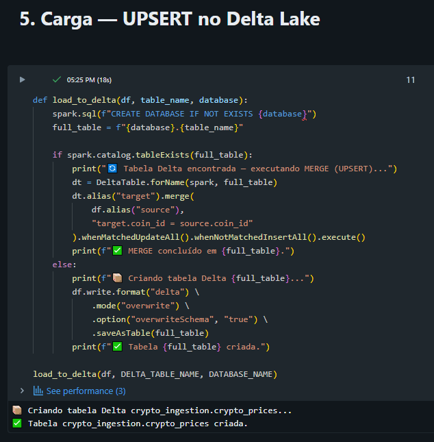
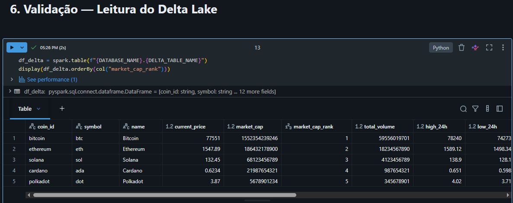
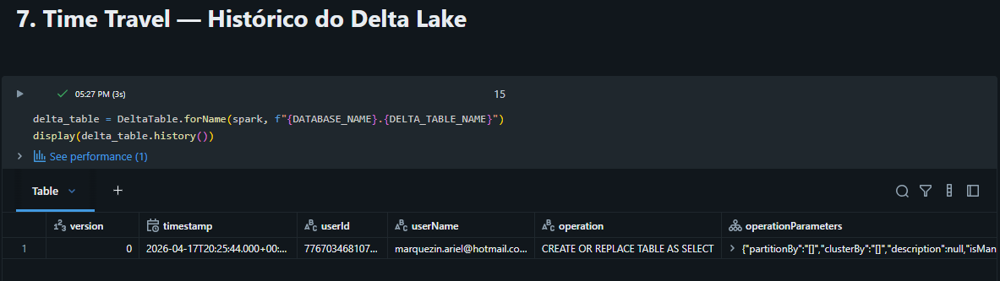
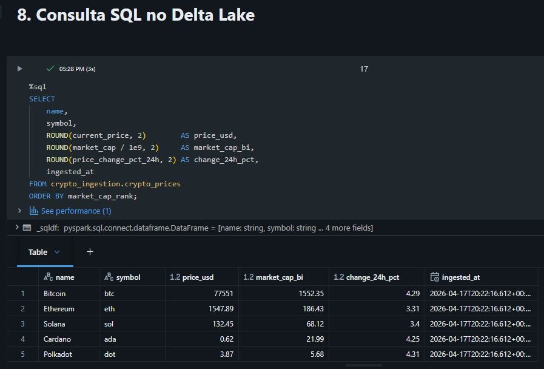

# 🪙 API Ingestion com Databricks — CoinGecko + PySpark + Delta Lake

Pipeline de ingestão de dados de criptomoedas utilizando **PySpark** e **Delta Lake** no **Azure Databricks**. O projeto implementa o padrão ETL completo com UPSERT incremental, schema tipado e Time Travel.

---

## 🏗️ Arquitetura do Pipeline

```
CoinGecko API
     │
     ▼
Extração (requests)
     │
     ▼
Transformação (PySpark — schema tipado)
     │
     ▼
UPSERT — Delta Lake (MERGE)
     │
     ▼
Validação + Time Travel + SQL
```

---

## 🖼️ Execução no Databricks

### 4. Transformação — PySpark DataFrame


Schema tipado com 14 campos, 5 criptomoedas carregadas e transformadas em DataFrame PySpark em 12s.

### 5. Carga — UPSERT no Delta Lake


Criação da tabela gerenciada `crypto_ingestion.crypto_prices` com suporte a MERGE incremental nas execuções seguintes.

### 6. Validação — Leitura do Delta Lake


Leitura de volta do Delta Lake confirmando integridade dos dados após a carga.

### 7. Time Travel — Histórico do Delta Lake


Histórico de versões da tabela Delta com rastreabilidade completa de operações e timestamps.

### 8. Consulta SQL no Delta Lake


Query SQL diretamente na tabela Delta com agregações e ordenação por market cap rank.

---

## 💡 Destaques Técnicos

- **Schema tipado** com `StructType` — garante consistência e evita inferência automática custosa
- **UPSERT com MERGE** — padrão incremental que atualiza registros existentes e insere novos sem duplicatas
- **Delta Lake gerenciado** — suporte nativo a ACID transactions e Time Travel
- **Time Travel** — rastreabilidade completa do histórico de versões da tabela
- **SQL sobre Delta** — consultas analíticas diretamente na camada de armazenamento

---

## 🛠️ Stack

| Tecnologia | Uso |
|---|---|
| Azure Databricks | Ambiente de execução |
| PySpark | Transformação e processamento distribuído |
| Delta Lake | Armazenamento com ACID + Time Travel |
| Python (requests) | Extração via API REST |
| SQL | Consultas analíticas sobre Delta Lake |

---

## 📁 Estrutura do Repositório

```
api-ingestion-databricks/
│
├── coingecko_ingestion.py    # Versão notebook — exploração interativa no Databricks
├── ingest_coingecko.py       # Versão modular — estrutura de produção
├── screenshots/              # Prints da execução no Databricks
│   ├── 04-transformacao-dataframe.png
│   ├── 05-carga-delta.png
│   ├── 06-validacao-delta.png
│   ├── 07-time-travel.png
│   └── 08-consulta-sql.png
└── README.md
```

---

## 📄 Sobre os Arquivos

**`coingecko_ingestion.py` — Notebook interativo**
Versão estruturada como notebook Databricks, com células Markdown, `display()` e execução passo a passo. Ideal para exploração, documentação visual e apresentação do pipeline no ambiente Databricks.

**`ingest_coingecko.py` — Versão modular para produção**
Versão refatorada com funções isoladas (`fetch_coin_data`, `transform`, `load_to_delta`), docstrings, tratamento de erros com retry e rate limit, e ponto de entrada `run_pipeline()`. Estrutura pronta para integração em jobs agendados, CI/CD ou orquestração com Airflow/Databricks Workflows.

---

## 🗄️ Sobre os Dados

Fonte: **CoinGecko API** — API pública de dados de criptomoedas.
Endpoint utilizado: `GET /api/v3/coins/markets?vs_currency=usd`

Moedas monitoradas: Bitcoin · Ethereum · Solana · Cardano · Polkadot

---

## 👤 Autor

**Ariel Marquezin**
Analista de Supply Chain & Dados | Power BI · SQL · Python · SAP S/4HANA

🔗 [linkedin.com/in/ariel-marquezin](https://linkedin.com/in/ariel-marquezin)
🐙 [github.com/MarquezinAriel](https://github.com/MarquezinAriel)
