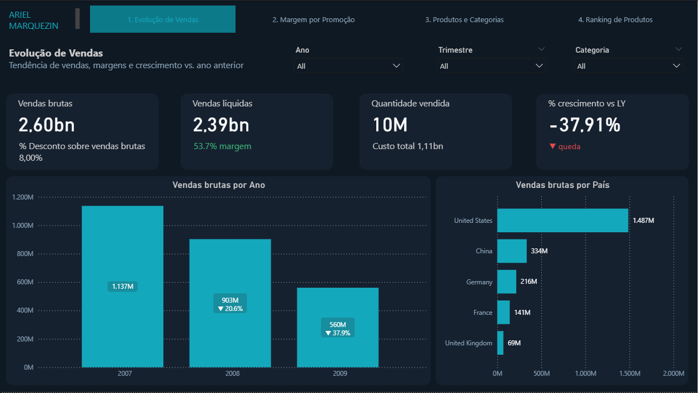

# 📊 Contoso Retail DW — Dashboard de Análise Comercial

Dashboard desenvolvido em **Power BI** com foco em análise de vendas, margem e performance de produtos para uma rede varejista global. Projeto criado como case analítico a partir do dataset público **Contoso Retail DW** (Microsoft).

---

## 🖼️ Visão Geral

### 1. Evolução de Vendas


Visão consolidada de vendas brutas, líquidas, quantidade vendida e crescimento vs. ano anterior. Permite análise temporal por ano, trimestre e categoria.

### 2. Margem por Promoção


Comparativo de eficiência entre campanhas promocionais com e sem desconto. Inclui avaliação automática de cada promoção (Excelente / Atenção ao desconto / Revisar) com base na margem resultante.

### 3. Produtos e Categorias


Análise de participação no total de vendas e eficiência de margem por categoria, tipo de loja e marca. Destaque para o **Bullet Chart** comparando margem real vs. meta de 55%, e **Heatmap** de margem por categoria x tipo de promoção.

### 4. Ranking de Produtos


Drill-down de performance por produto, tipo de loja e categoria. Inclui ranking de margem por produto e ano, com tabela hierárquica de participação no total de vendas.

---

## 💡 Principais Insights

- Crescimento de **27,48%** nas vendas brutas entre 2007 e 2009
- **EUA** representam 57% das vendas brutas globais (R$ 1,487bn)
- Promoções com desconto reduzem a margem de **57,37% → 51,57%** — impacto de ~6pp
- Categorias **Games & Toys** e **TV and Video** estão consistentemente abaixo da meta de margem de 55%
- **Seasonal Discount** gera maior volume bruto mas compromete margem — sinaliza necessidade de revisão das campanhas asiáticas (Asian Holiday e Asian Spring com margem abaixo de 50%)
- Canal **Online** apresenta melhor margem relativa vs. loja física em quase todas as categorias

---

## 🛠️ Ferramentas e Técnicas

| Ferramenta | Uso |
|---|---|
| Power BI Desktop | Desenvolvimento do dashboard |
| DAX | Medidas calculadas (margem, crescimento YoY, % participação) |
| Power Query | Transformação e modelagem dos dados |
| SQL Server (ContosoRetailDW) | Fonte de dados original |

**Visuais utilizados:**
- KPI Cards com variação vs. período anterior
- Gráfico de barras e colunas com anotações
- Scatter Plot (dispersão desconto x margem por categoria)
- Bullet Chart (margem real vs. meta)
- Heatmap condicional
- Tabela hierárquica com drill-down
- Navegação por abas com botões

---

## 📁 Estrutura do Repositório

```
contoso-retail-dw-powerbi/
│
├── contoso-retail-dw-dashboard.pbix   # Arquivo Power BI
├── screenshots/                        # Prints das 4 páginas do dashboard
│   ├── 01-evolucao-vendas.png
│   ├── 02-margem-promocao.png
│   ├── 03-produtos-categorias.png
│   └── 04-ranking-produtos.png
└── README.md
```

---

## 🗄️ Sobre os Dados

Dataset utilizado: **Contoso Retail DW** — banco de dados de demonstração público disponibilizado pela Microsoft, amplamente utilizado em treinamentos e projetos de Business Intelligence.

🔗 [Download ContosoRetailDW — Microsoft](https://www.microsoft.com/en-us/download/details.aspx?id=18279)

> Para abrir o `.pbix`, configure a conexão com o SQL Server local após importar o ContosoRetailDW, ou adapte para leitura via CSV.

---

## 👤 Autor

**Ariel Marquezin**  
Analista de Supply Chain & Dados | Power BI · SQL · Python · SAP S/4HANA  
🔗 [linkedin.com/in/ariel-marquezin](https://linkedin.com/in/ariel-marquezin)  
🐙 [github.com/MarquezinAriel](https://github.com/MarquezinAriel)
