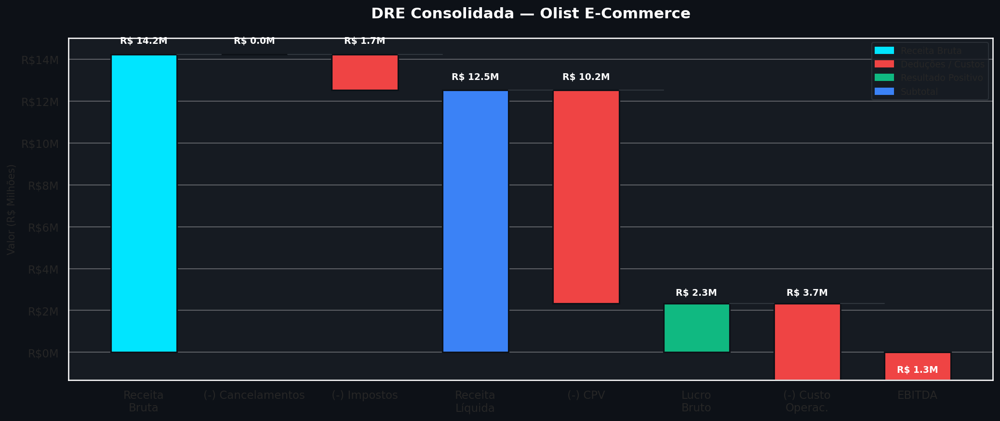
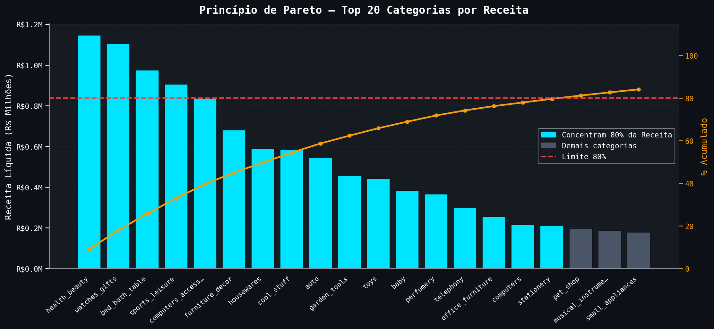
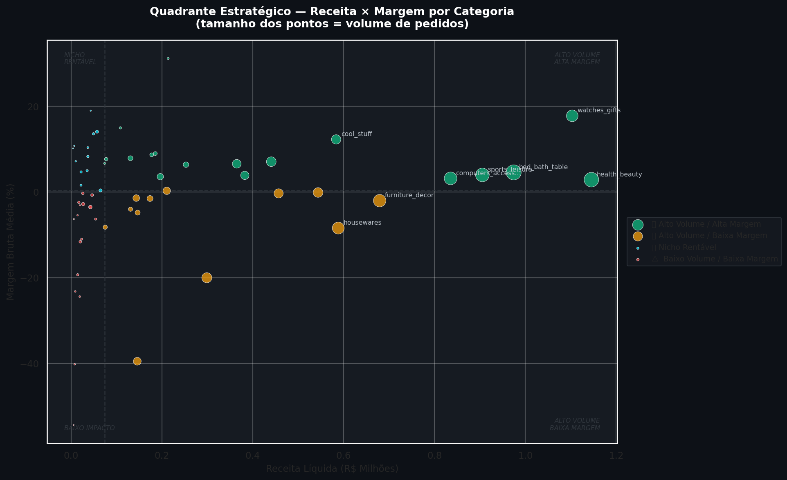
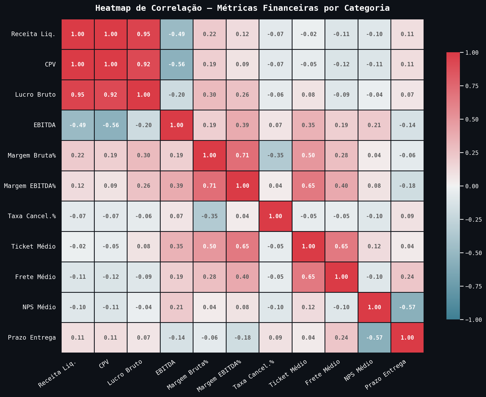
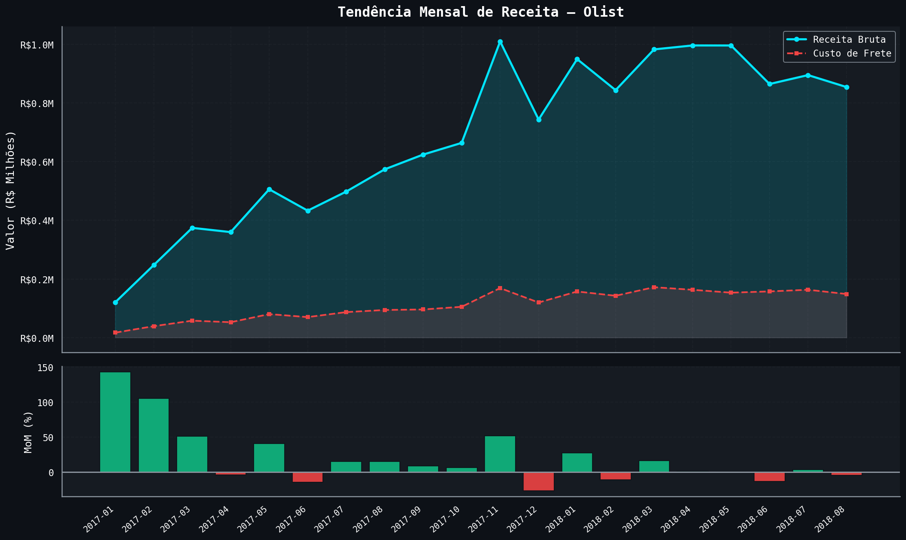
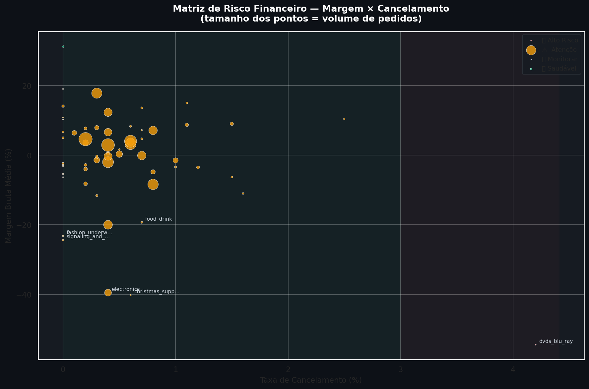
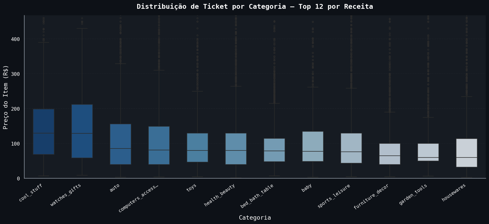
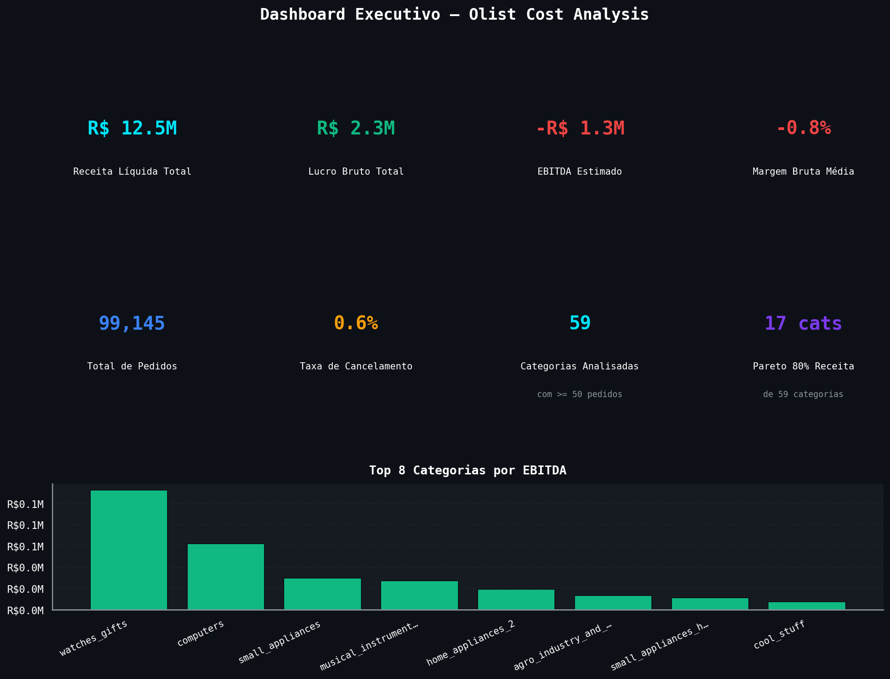
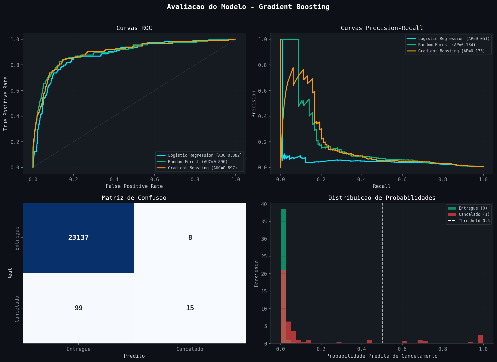
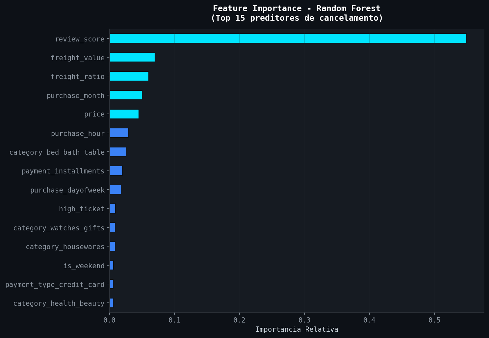

# 📊 Olist Cost Analysis — Margem, CPV e DRE por Categoria

> **Análise financeira end-to-end** do dataset público Olist, construída com pipeline completo de engenharia de dados e storytelling baseado na metodologia STAR.

---

## 🧠 Contexto — Metodologia STAR

### Situation
Uma empresa de e-commerce brasileiro opera com dezenas de categorias de produto e alto volume de pedidos. A gestão financeira enfrenta um problema clássico: **visibilidade baixa sobre quais categorias realmente geram margem** — e quais estão consumindo CPV e custo operacional sem retorno proporcional.

### Task
Construir um **pipeline analítico end-to-end** que, partindo de dados brutos de pedidos, entregue:
- Uma **DRE simplificada por categoria** com Receita Bruta → Lucro Bruto → EBITDA estimado
- Identificação das categorias de **maior e menor rentabilidade** (quadrante Receita × Margem)
- Análise de **Pareto de receita** e **giro de estoque simulado**
- Um **modelo preditivo** de cancelamento de pedidos (risco de perda de receita)

### Action
Pipeline construído em 5 notebooks progressivos com stack moderna de dados:

1. **Ingestão** — PySpark + PyArrow → Parquet (camada Bronze)
2. **Transformação** — DuckDB + pandas + numpy → métricas financeiras + DRE (camada Gold)
3. **SQL Avançado** — Window Functions, Pareto, Giro de Estoque, Tendência MoM
4. **Visualização** — Matplotlib + Seaborn → storytelling visual completo (8 figuras)
5. **Modelo Preditivo** — Scikit-learn → classificador de cancelamento com 3 algoritmos

### Result
- **Receita Líquida Total analisada:** R$ 12,5M
- **Lucro Bruto:** R$ 2,3M | **EBITDA Estimado:** R$ -1,3M
- **17 categorias** concentram 80% da receita (Princípio de Pareto) — de 59 analisadas
- **Taxa de cancelamento:** 0,6% sobre 99.145 pedidos
- **Melhor modelo preditivo:** Gradient Boosting com ROC-AUC de **0.897**
- Modelo capaz de identificar **R$ 6.728 em receita em risco** de cancelamento (24% do total em risco)

---

## 📈 Visualizações

### DRE Consolidada — Waterfall
> Cascata financeira completa: da Receita Bruta ao EBITDA estimado, passando por cancelamentos, impostos, CPV e custo operacional.



---

### Princípio de Pareto — Receita por Categoria
> 17 categorias concentram 80% da receita líquida total. As barras em ciano representam esse grupo estratégico.



---

### Quadrante Estratégico — Receita × Margem
> Posicionamento de cada categoria nos quatro quadrantes: Alto Volume/Alta Margem, Nicho Rentável, Alto Volume/Baixa Margem e Baixo Impacto. O tamanho dos pontos representa o volume de pedidos.



---

### Heatmap de Correlação — Métricas Financeiras
> Correlação entre receita, CPV, margem, EBITDA, ticket médio, frete, NPS e prazo de entrega por categoria.



---

### Tendência Mensal — Receita e MoM
> Evolução mês a mês da receita bruta e custo de frete, com variação percentual MoM (Month-over-Month) em barras.



---

### Matriz de Risco — Margem × Cancelamento
> Identificação das categorias críticas: baixa margem combinada com alta taxa de cancelamento representa o maior risco financeiro.



---

### Distribuição de Ticket por Categoria
> Boxplot das top 12 categorias por receita, mostrando mediana, dispersão e outliers de preço.



---

### Dashboard Executivo — KPIs Consolidados
> Painel com os principais indicadores financeiros do projeto: receita, lucro, EBITDA, margem, pedidos e top 8 categorias por EBITDA.



---

### Avaliação do Modelo Preditivo
> Curvas ROC e Precision-Recall dos 3 modelos, Matriz de Confusão e distribuição de probabilidades do melhor modelo (Gradient Boosting, ROC-AUC = 0.897).



---

### Feature Importance — Random Forest
> Top 15 variáveis preditoras de cancelamento, mostrando quais características do pedido mais influenciam o risco.



---

## 🏗️ Arquitetura

```
CSV (Olist Kaggle)
       │
       ▼
 ┌─────────────┐    PySpark + PyArrow
 │  Bronze     │ ◄──────────────────── 01_ingestao.ipynb
 │  (Parquet)  │
 └─────────────┘
       │
       ▼
 ┌─────────────┐    DuckDB + pandas + numpy
 │  Gold       │ ◄──────────────────── 02_transformacao.ipynb
 │  (DRE, KPIs)│    03_analise_cpv.ipynb
 └─────────────┘
       │
       ▼
 ┌─────────────┐    Matplotlib + Seaborn
 │  Insights   │ ◄──────────────────── 04_visualizacao.ipynb
 │  Visuais    │
 └─────────────┘
       │
       ▼
 ┌─────────────┐    Scikit-learn
 │  Modelo ML  │ ◄──────────────────── 05_modelo.ipynb
 │  Cancelam.  │
 └─────────────┘
```

> **Nota sobre SAP HANA:** Em ambiente produtivo, a ingestão viria de views do SAP/HANA via `hdbcli`. O bloco de conexão está documentado no notebook 01 como referência arquitetural — refletindo a stack utilizada no ambiente industrial atual.

> **Nota sobre Azure:** O Storage Account (ADLS Gen2) foi provisionado e configurado no código como camada de armazenamento em nuvem. O pipeline foi executado no Google Colab com persistência via Google Drive.

---

## 🐍 Stack Técnica

| Biblioteca | Uso no projeto |
|---|---|
| **PySpark** | Leitura dos CSVs, tratamento e validação em escala |
| **PyArrow** | Conversão para Parquet Snappy, schema enforcement |
| **DuckDB** | SQL analítico direto nos Parquet, Window Functions |
| **pandas** | Manipulação de DataFrames, rankings, exportação |
| **numpy** | Cálculos vetorizados: CPV, margem, métricas financeiras |
| **Seaborn** | Heatmap de correlação, boxplot por categoria |
| **Matplotlib** | DRE visual, Pareto, quadrante estratégico, dashboard |
| **Scikit-learn** | 3 classificadores + Pipeline + ColumnTransformer |

### ☁️ Infraestrutura
- **Google Colab** — ambiente de desenvolvimento e execução dos notebooks
- **Google Drive** — persistência dos arquivos Parquet e figuras entre sessões
- **Azure Blob Storage** — Storage Account provisionado com Hierarchical Namespace (ADLS Gen2)

---

## 📁 Estrutura do Repositório

```
olist-cost-analysis/
├── notebooks/
│   ├── 01_ingestao.ipynb
│   ├── 02_transformacao.ipynb
│   ├── 03_analise_cpv.ipynb
│   ├── 04_visualizacao.ipynb
│   └── 05_modelo.ipynb
├── sql/
│   └── queries_cpv.sql
├── figures/
│   ├── 01_waterfall_dre.png
│   ├── 02_pareto_receita.png
│   ├── 03_quadrante_estrategico.png
│   ├── 04_heatmap_correlacao.png
│   ├── 05_tendencia_mensal.png
│   ├── 06_matriz_risco.png
│   ├── 07_boxplot_ticket.png
│   ├── 08_dashboard_final.png
│   ├── 09_model_evaluation.png
│   └── 10_feature_importance.png
├── .gitignore
├── requirements.txt
└── README.md
```

---

## 📊 Principais Resultados

| Métrica | Valor |
|---|---|
| Receita Líquida Total | R$ 12,5M |
| Lucro Bruto | R$ 2,3M |
| EBITDA Estimado | R$ -1,3M |
| Margem Bruta Média | -0,8% |
| Total de Pedidos Analisados | 99.145 |
| Taxa de Cancelamento | 0,6% |
| Categorias Analisadas | 59 |
| Categorias que concentram 80% da receita | 17 |
| Melhor Modelo Preditivo | Gradient Boosting |
| ROC-AUC | 0.897 |
| CV-AUC (validação cruzada) | 0.912 |
| Receita em risco identificada pelo modelo | R$ 6.728 (24% do total em risco) |

---

## 🚀 Como Reproduzir

### 1. Dataset
Baixe o dataset no Kaggle:
🔗 [Brazilian E-Commerce Public Dataset by Olist](https://www.kaggle.com/datasets/olistbr/brazilian-ecommerce)

### 2. Ambiente
```bash
git clone https://github.com/MarquezinAriel/Data-Pipelines
cd Data-Pipelines/olist-cost-analysis
pip install -r requirements.txt
```

### 3. Execução
Abra cada notebook no Google Colab, monte o Google Drive e execute na ordem:
`01_ingestao` → `02_transformacao` → `03_analise_cpv` → `04_visualizacao` → `05_modelo`

---

## 💼 Sobre o Projeto

Este projeto foi desenvolvido como parte do portfólio de transição para **Analista de Dados**, demonstrando:

- Domínio de **pipeline de dados** completo (ingestão → transformação → visualização → ML)
- Capacidade de construir **análises financeiras** (DRE, CPV, margem, EBITDA) com dados reais
- Uso de **stack moderna** alinhada ao mercado (Spark, DuckDB, Azure, Parquet)
- **Storytelling orientado a negócio** com metodologia STAR

---

## 👤 Autor

**Ariel Marquezin**
Analista de Dados | Python · SQL · Power BI · Azure · PySpark · DuckDB
🔗 [LinkedIn](https://linkedin.com/in/ariel-marquezin) · [GitHub](https://github.com/MarquezinAriel)